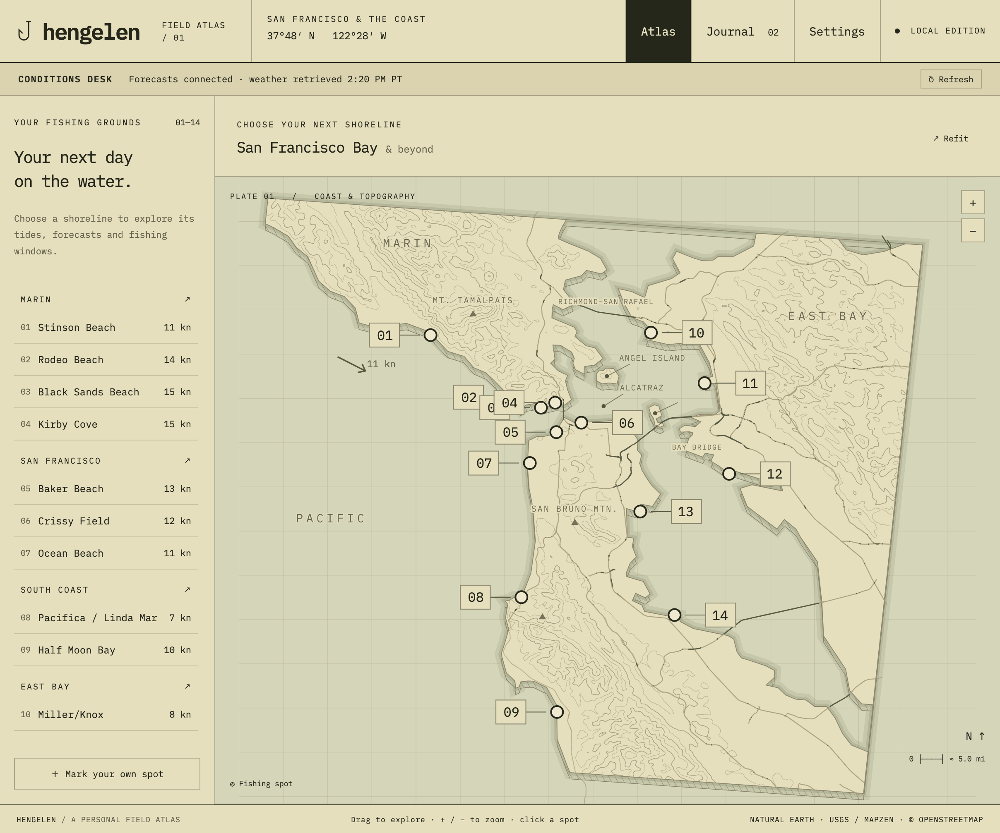

# Hengelen

A desktop-first shore-fishing field atlas for San Francisco Bay and the coast from Stinson Beach to Half Moon Bay. The current runtime is local; the planned public edition is documented below.

Run `npm install` once, then `npm run dev` and open http://127.0.0.1:4317. Requires Node 22.12+ and internet access for new forecasts. Development watches `src/` and `public/`, rebuilds generated `dist/` output after edits, and keeps the loopback-only server running; reload the browser to see a rebuild. `npm start` creates a production build before starting the same local server. There are no API keys or hosted services to configure.

The server binds to loopback by default; to host it publicly, set `HENGELEN_HOST=0.0.0.0` (or `HOST`) and `HENGELEN_ALLOWED_HOSTS` to your public hostname. Allowlist entries are plain hostnames without ports — the server strips any port from the request's `Host` header before matching. Set `HENGELEN_HSTS=1` when serving behind HTTPS.

## Project layout

- `src/`: authored browser code, HTML, and CSS.
- `public/`: static map data and fonts copied into the build.
- `dist/`: disposable Vite output; do not edit it directly.
- `dev.mjs`: watched development build and local-server startup.
- `server.mjs`: HTTP server with host allowlist, security headers, and read-only forecast APIs.
- `forecast.mjs`: provider requests, normalization, and caching.
- `test/`: Node unit and source-structure tests.
- `data/`: ignored local cache, journal, custom spots, and settings.

## Conditions
- Open-Meteo: seven-day hourly wind, gusts, wind direction, rain chance, air temperature, sunrise/sunset and daylight; knots and °F. Forecast grid coordinates are disclosed. Open-Meteo free access is for personal/noncommercial use; data attribution CC BY 4.0.
- NOAA CO-OPS: predictions in feet MLLW, six-minute tide curves at harmonic stations, separate high/low events, and regional current max/slack events. Subordinate stations show events only. Stinson uses the Ocean Beach outer-coast reference, not Bolinas Lagoon. No artificial curves or tide-to-current inferences.
- NOAA Torpedo Wharf: recent wind, water level, and temperature where available. All are explicitly regional observations with their own timestamps. Missing sensors stay unavailable.
- Open-Meteo Marine / DWD: offshore waves and swell for ocean-facing pins, converted from meters to feet. Not beach breaker heights or a bay surf model.
- NWS: active point alerts. Retrieval failure is distinct from an empty alert list. Alerts are current, not a promise about a future date.

Source failures never substitute sample data. Cache records retain retrieval timestamps and are marked stale when refresh fails. Weather is cached for 30 minutes, marine for one hour, tide/current predictions for six hours, observations for five minutes, alerts for ten minutes. A manual Refresh checks these caches; it does not bypass provider-friendly cache intervals. The forecast cache lives in memory only; restarting the server refetches.

## Guidance
Wind windows require at least two consecutive daylight hours, forecast wind at/below the user limit, and gusts no more than three knots above it. They are casting-comfort windows, not fish-activity scores or wading clearance. Tide/current timing remains contextual. Wind direction is shown as factual context; ranking does not infer casting comfort from handedness or shoreline orientation.

Access notes link to official NPS, State Parks and EBRPD sources, reviewed 2026-09-21. The East Bay exploratory locations are labeled Scout first where the source does not establish a shore fly-casting entry. Check the linked sources for changing closures, rules and water-quality conditions.

## Records
The hosted build keeps no server-side records: the journal, custom pins, and saved preferences were removed for public hosting. The wind-limit control applies for the current visit only. Nothing is written to disk — there is no `data/state.json`, no export, and no forecast cache files. Forecast responses are cached in memory for the intervals listed above; restarting the server refetches.

The planned first public edition excludes journals, custom spots, accounts, and backup/import. Small preferences such as the wind-comfort limit stay in browser `localStorage`.

## Map
Natural Earth 1:10m land (public domain). Terrain: Mapzen Terrain Tiles on AWS, USGS 3DEP, accessed 2026-09-21; resampled and generalized into 50 m contours (100 m overview). Roads/bridges © OpenStreetMap contributors, ODbL. Sources: https://registry.opendata.aws/terrain-tiles/ , https://github.com/tilezen/joerd/blob/master/docs/attribution.md , https://www.openstreetmap.org/copyright . Shoreline bands are decorative, not bathymetry. Orientation labels and geometry are generalized; this is not a navigation chart.

Visual inspiration: inkboard/system-atlas (MIT), adapted to a geographical atlas. Plex fonts copied from the local Kritiek reference project. Drag or arrow keys on the focused map to pan; zoom reveals finer contours; Refit resets.

## Verification
`npm run build` creates the disposable client in `dist/` from authored files in `src/` and static assets in `public/`. `npm run format:check` checks formatting. `npm run check` checks JavaScript syntax and verifies a production build. `npm test` checks unit conversions, missing-data behavior, tide interpolation boundaries, wind-window criteria, state validation, source structure, and server request handling (host allowlist, security headers, removed endpoints). Provider and browser flows require separate HTTP and browser smoke checks because the automated suite does not call live upstream services.

### Session planning

The central timeline aligns tide height (feet MLLW), wind/gusts (knots), and discrete reference current events on the same Pacific time axis. Night and candidate sessions are shaded. Events-only tide references display a dashed half-cosine estimate between valid alternating NOAA high/low predictions. Dots show the NOAA events; interpolated heights are explicitly approximate. No extrapolation or bridging missing events is performed. Session ranking still treats these stations as lacking a full NOAA curve.

Sessions are two complete daylight hours within the wind/gust preferences. Explicit starting heuristics favor proximity to sunrise/sunset, changing tide height in either direction, and smaller offshore swell. Current events are explanatory context, not a proxy for current speed at the shore. Missing/stale references make a session provisional; fresh weather is required. Suggestions are ranked within the selected day and do not overlap. These preferences are not calibrated catch predictions or safety ratings.

“Compare spots at this time” loads detailed references with three concurrent requests and compares the same two-hour interval. Dates outside forecast coverage are recorded as unavailable instead of borrowing unrelated conditions.

### Navigation and task tracking

The home page is an atlas overview. Selecting a map marker or sidebar location opens a dedicated page (`#spot/<id>`) with a mini-map, conditions timeline, session suggestions, and shore notes. The location selector and browser back button support navigation; returning to the atlas restores its map position.

Track work in [GitHub Issues](https://github.com/ademey/hengelen/issues). Link substantive changes to an issue, record validation, and close completed tasks when delivered. See `AGENTS.md` for the project workflow.

The proposed public architecture, privacy boundary, provider review, and staged rollout are documented in [docs/public-hosting.md](docs/public-hosting.md). It is a plan only; no public infrastructure has been provisioned.
